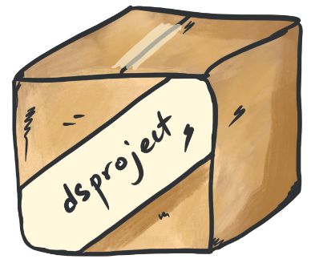

# dsproject



This package allows the user to create a new RStudio project, import dataset, and install and load necessary packages.

## Installation

You can install the package by running the following:

``` r
if(!require(devtools)){
  install.packages("devtools")
}
devtools::install_github("NaraaAltai/dsproject")
```


